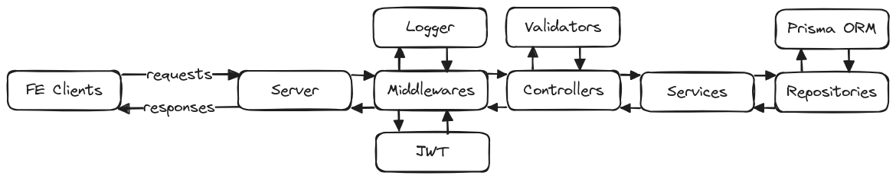

# DMS Web Backend

## Description

This is the backend application for the Driver Monitoring System (DMS) web application. It is built using [Node.js](https://nodejs.org/), the [Express](https://expressjs.com/) web framework, and the [Prisma](https://www.prisma.io/) ORM. It is responsible for serving the web application, handling user authentication, and managing the data stored in the [MySQL](https://www.mysql.com/) database.

## Documentation

### Application Architecture

The application is structured as follows:



### API Documentation

The API documentation is hosted on [Postman Documenter](https://documenter.getpostman.com/view/31263321/2sA3QtcWEb).

### Database Schema

The database schema is managed using Prisma Migrate. The schema is defined in the [schema.prisma](prisma/schema.prisma) file.

## Getting Started

1. If you do not use devcontainer, ensure you have [Node.js](https://nodejs.org/en/download/) version 20 or higher installed:

    ```bash
    node -v
    ```

2. Install the required NPM packages:

    ```bash
    npm install
    ```

3. Create a copy of the `.env.example` file and rename it to `.env`:

    ```bash
    cp .env.example .env
    ```

    Update the configuration values as needed.

4. Ensure the MySQL database is running and the schema is created:

    ```bash
    npm run migrate:dev
    ```

5. Run the application:

    ```bash
    npm run dev
    ```

## License

This project is licensed under the [MIT License](LICENSE), providing an open and permissive licensing approach for further development and distribution.
